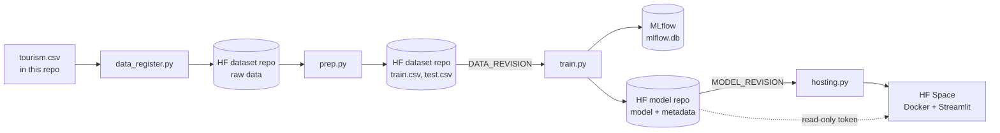

# Visit with Us – Wellness Tourism MLOps Pipeline

End-to-end MLOps pipeline that predicts, before a customer is contacted, whether that customer is likely
to buy the new Wellness Tourism Package (`ProdTaken`). The sales team can then contact the most promising
customers first instead of calling everyone.

The pipeline registers the data, prepares it, trains and selects a model with experiment tracking, registers
the model, and publishes a Streamlit app. It runs in two ways, with exactly the same scripts:

- **Notebook** – [`tourism.ipynb`](tourism.ipynb) writes every script with `%%writefile` and runs it with
  `%run -m`, in Google Colab or locally.
- **GitHub Actions** – [`.github/workflows/pipeline.yml`](.github/workflows/pipeline.yml) runs the same scripts
  with `python -m` on every push to `main`.

| Component | Where |
|---|---|
| Source code and workflow | this repository |
| Raw data and train/test split | Hugging Face dataset `richvrb/tourism-wellness-data` (private) |
| Registered model | Hugging Face model `richvrb/tourism-wellness-model` (private) |
| Streamlit app *Score a Lead* | Hugging Face Space [`richvrb/tourism-wellness-app`](https://huggingface.co/spaces/richvrb/tourism-wellness-app) – live at <https://richvrb-tourism-wellness-app.hf.space> |
| Experiment results | summary page and `mlflow` artifact of each [workflow run](https://github.com/richardverbrugge-oss/tourism/actions) |

---

## Architecture



The Hugging Face Hub is the shared storage between the stages: each stage reads its input from the Hub and
writes its output back. Each stage passes the exact commit it produced to the next one (`DATA_REVISION`,
`MODEL_REVISION`), so training uses exactly the split that was just made, and the app serves exactly the
model that was just registered.

---

## Repository structure

```
.
├── tourism.ipynb                         notebook: writes and runs every script (the deliverable)
├── .github/
│   ├── workflows/pipeline.yml            GitHub Actions pipeline, 4 jobs
│   └── actions/setup-pipeline/action.yml shared setup: Python 3.12 + pinned packages
└── tourism_project/
    ├── config.py                         central Config dataclass: every setting, defined once
    ├── hub.py                            Hugging Face helpers: private repos, revisions, loading splits
    ├── ci.py                             GitHub Actions helpers: job outputs and run summary
    ├── requirements.txt                  pinned packages for the pipeline jobs
    ├── data/tourism.csv                  raw dataset (4,128 customers)
    ├── model_building/
    │   ├── data_register.py              stage 1: register the raw data
    │   ├── prep.py                       stage 2: clean, group near-copies, split
    │   └── train.py                      stage 3: train, track, select, evaluate, register
    ├── deployment/                       everything the Space builds
    │   ├── Dockerfile
    │   ├── .dockerignore
    │   ├── .streamlit/config.toml
    │   ├── README.md                     Space configuration (sdk: docker, app_port: 8501)
    │   ├── requirements.txt              pinned packages for the app
    │   └── app.py                        Streamlit app
    └── hosting/
        └── hosting.py                    stage 4: publish the app to the Space
```

Local outputs (`outputs/`: splits, model bundle, `mlflow.db`) are not committed; they live on the Hub.

---

## Shared modules

**`config.py`** – One frozen `Config` dataclass holds every setting: repository names, file names, target and
feature columns, cleaning rules, split sizes, search spaces, selection rules and deployment settings. Every
script receives this one object, so a change is made in one place and applies to the notebook and the
pipeline alike. Each setting carries a comment explaining why it has its value.

**`hub.py`** – Creates repositories as private, resolves which revision a stage should use (explicit value →
environment variable → newest commit), and loads a split while checking its columns.

**`ci.py`** – Writes job outputs (`$GITHUB_OUTPUT`) and markdown tables to the run summary
(`$GITHUB_STEP_SUMMARY`). Outside GitHub Actions these functions do nothing.

---

## Stage 1 – Data registration

[`model_building/data_register.py`](tourism_project/model_building/data_register.py)

Creates the private dataset repository on the Hugging Face Hub and uploads `tourism.csv`. Unchanged data
creates no new commit.

## Stage 2 – Data preparation

[`model_building/prep.py`](tourism_project/model_building/prep.py)

1. **Load** the raw data from the dataset repository.
2. **Clean** – `"Fe Male"` → `"Female"`; three impossible monthly incomes and four impossible trip counts become
   missing values (filled in later by the model's imputer, using training data only).
3. **Group near-copies** – The dataset contains near-identical copies of customer records. Every pair of rows
   gets an evidence score in bits: agreeing on a rare value counts more than agreeing on a common one. The
   scores form two clearly separated clusters; pairs above 24 bits are copies. Connected copies share a
   `group_id`.
4. **Split** – Group-aware stratified split (`StratifiedGroupKFold`, 80/20): a group is never divided over train
   and test, so the model is never tested on a copy of a customer it was trained on. With a plain split,
   478 of the 826 test rows had a near-copy in train. Checks: equal share of buyers, correct test size.
5. **Select columns and upload** – Only the 14 features known before contact are kept; the four sales-pitch
   columns (`DurationOfPitch`, `NumberOfFollowups`, `PitchSatisfactionScore`, `ProductPitched`) and
   `CustomerID` are dropped. `train.csv` (3,302 rows) and `test.csv` (826 rows) are uploaded in one commit,
   whose id is passed on as `data_revision`.

| Feature type | Columns |
|---|---|
| Numeric (7) | Age, CityTier, NumberOfPersonVisiting, PreferredPropertyStar, NumberOfTrips, NumberOfChildrenVisiting, MonthlyIncome |
| Binary (2) | Passport, OwnCar |
| Categorical (5) | TypeofContact, Occupation, Gender, MaritalStatus, Designation |

## Stage 3 – Model training, experiment tracking and registration

[`model_building/train.py`](tourism_project/model_building/train.py)

All selection rules are fixed in `Config` before any model is trained.

1. **Load** the split at `DATA_REVISION`.
2. **Candidates** – each a scikit-learn `Pipeline` of preprocessing (median imputation for numbers, most frequent
   value + one-hot encoding for categories) and a model: dummy baseline, Random Forest baseline, XGBoost
   baseline, tuned Random Forest, tuned XGBoost. Class imbalance (19% buyers) is handled with `class_weight`
   and `scale_pos_weight`.
3. **Cross-validation and tuning** – group-aware 5-fold CV on the train set only, ranked on PR-AUC
   (average precision). Tuned models use `RandomizedSearchCV` (30 combinations).
4. **Selection** – gate: PR-AUC must beat the dummy model by at least 0.10. The two best models are compared
   again on 15 paired folds (3 seeds); a difference within one standard error is a tie, broken by precision in
   the top 10%, stability, overfitting and simplicity.
5. **Operating points** – decision thresholds from out-of-fold scores: best F1, and the top 5%, 10% and 20% of
   customers (for a fixed calling budget), with precision, recall and lift.
6. **Test set, used once** – PR-AUC, ROC-AUC and the operating points, with bootstrap 95% confidence intervals.
   Checks: CV and test must not differ by more than 0.05 (warning); a test ROC-AUC above 0.90 is implausible for
   pre-contact features and stops the run before registration (leakage guard).
7. **Registration** – the fitted pipeline (`model.joblib`), `model_metadata.json` (features, input ranges,
   category values, thresholds, package versions, check profiles with their expected scores) and
   `operating_points.csv` are uploaded to the private model repository in one commit, whose id is passed on
   as `model_revision`.

**Experiment tracking with MLflow** – every candidate is logged as a run with all tuned hyperparameters,
CV metrics (mean and standard deviation over the folds), tags (feature set, model family, data revision, selection status and
reason for rejection) and, for the final run, the test metrics and operating points. Autologging is only
enabled during the hyperparameter search (its 5 best combinations). Runs are stored in `outputs/mlflow.db`
(SQLite). In the notebook the MLflow UI can be opened directly; in GitHub Actions the results appear on the
run summary page and the database is kept as the artifact `mlflow`:

```bash
mlflow ui --backend-store-uri sqlite:///mlflow.db
```

**Current result** – the tuned Random Forest is selected.

| Metric | Value |
|---|---|
| CV PR-AUC (train) | 0.615 |
| Test PR-AUC | 0.643 |
| Test ROC-AUC | 0.874 |
| Precision when contacting the top 10% (test) | 68% (95% CI 59–77%), 3.5× better than random |

## Stage 4 – Deployment

[`deployment/`](tourism_project/deployment)

**Streamlit app *Score a Lead*** (`app.py`) – A lead is a customer who has not been contacted yet. A sales
employee enters the profile of one lead; the app returns a ranking score and the contact group the lead falls
into (top 5%, 10% or 20%), with how that group performed on the test set.

- The model, metadata and operating points are downloaded from the private model repository at the pinned
  `MODEL_REVISION`, with a read-only token (Space secret `HF_TOKEN`).
- The inputs are collected into a one-row pandas DataFrame in the model's column order.
- Form fields follow the metadata: only known categories, and the training range shown for every number. A
  value outside the training range gets no score, because the model has no information about such
  customers.
- At start-up the app checks that installed package versions equal the training versions and that the check
  profiles get exactly the stored scores; otherwise it stops.
- The score is presented as a ranking, not a probability, because it was not calibrated.
- No file upload and no logging of inputs: no customer data is sent to or kept on a public server.

**Dockerfile** – `python:3.12-slim`, packages installed from `requirements.txt`, runs as non-root user uid 1000
(required by Spaces), contains only `app.py` and `.streamlit/config.toml` (whitelist in `.dockerignore`),
exposes port 8501. The image is not built in this repository: Hugging Face builds it from these files in the
Space and keeps it there, so no container registry is involved.

**Dependencies** (`requirements.txt`) – exact versions. pandas, numpy, scikit-learn, xgboost and joblib must
equal the training versions, because a pickled model only loads and scores reliably with the same versions.

**Streamlit settings** (`.streamlit/config.toml`) – headless, XSRF protection on, no usage statistics, no
error details shown to visitors.

## Stage 5 – Hosting

[`hosting/hosting.py`](tourism_project/hosting/hosting.py)

1. Makes sure the Docker Space exists and is public.
2. Determines the model version (`MODEL_REVISION`, or the newest model commit).
3. Stores `MODEL_REPO` and `MODEL_REVISION` as Space variables and checks that the Space secret `HF_TOKEN`
   exists. It never sets a token itself.
4. Uploads only the whitelisted deployment files in one commit.
5. Follows the build until the Space is `RUNNING` and checks that the public address answers without login.

---

## MLOps pipeline with GitHub Actions

[`.github/workflows/pipeline.yml`](.github/workflows/pipeline.yml)

**Trigger** – every push to `main` that changes `tourism_project/**` or `.github/**`, and manually from the
Actions tab. Changes to only the notebook or this README do not retrain the model. One run at a time.

| Job | Needs | What it does | Output |
|---|---|---|---|
| `register-dataset` | – | `python -m tourism_project.model_building.data_register` | |
| `data-prep` | register-dataset | `python -m tourism_project.model_building.prep` | `data_revision` |
| `model-training` | data-prep | `python -m tourism_project.model_building.train` with `DATA_REVISION`; uploads artifact `mlflow` | `model_revision` |
| `deploy-hosting` | all three | `python -m tourism_project.hosting.hosting` with `MODEL_REVISION`; Hugging Face then builds and starts the app | |

Every job starts on a fresh `ubuntu-latest` machine and uses the local action
[`setup-pipeline`](.github/actions/setup-pipeline/action.yml): Python 3.12 and the pinned packages from
[`tourism_project/requirements.txt`](tourism_project/requirements.txt), with a pip cache. A full run takes
about 11 minutes, most of it training.

---

## Running it

### Secrets

| Where | Name | Access |
|---|---|---|
| GitHub repository (Settings → Secrets and variables → Actions) | `HF_TOKEN` | write: dataset repo, model repo, Space |
| Google Colab (Secrets) | `HF_TOKEN` | write: dataset repo, model repo, Space |
| Hugging Face Space (Settings → Secrets) | `HF_TOKEN` | read-only, model repo only |

Tokens are never written in code, notebook cells or logs.

### Google Colab

Upload `tourism.ipynb`, add the `HF_TOKEN` secret, upload `tourism.csv` into `tourism_project/data/` when the
data folder cell asks for it, and run all cells. The setup cell installs the packages Colab lacks.

### Locally

```bash
pip install -r tourism_project/requirements.txt
export HF_TOKEN=...            # or: hf auth login
jupyter notebook tourism.ipynb # or run the stages directly:
python -m tourism_project.model_building.data_register
python -m tourism_project.model_building.prep
python -m tourism_project.model_building.train
python -m tourism_project.hosting.hosting
```

Run the commands from the repository root. Python 3.12 is required.

### Through GitHub Actions

Push a change under `tourism_project/` or `.github/` to `main`, or start *Tourism Project Pipeline* manually
from the Actions tab.

---

## Design decisions

- **Only pre-contact features** – the prediction is used to decide whom to contact, so it may only use what is
  known at that moment. The pitch columns would inflate the scores but cannot be used in practice.
- **Group-aware splitting** – near-copies of customers would otherwise leak from train into test and
  cross-validation folds and make the model look better than it is.
- **PR-AUC for selection** – with 19% buyers, PR-AUC reflects how well buyers are ranked on top; F1, precision
  and lift per contact budget are reported for the business decision.
- **Pinned revisions and versions** – every stage uses an exact data or model commit and exact package versions,
  so a run is reproducible and the app scores exactly like the trained model.
- **Private data, public app** – the dataset and model repositories are private; the public app holds only a
  read-only token and never receives customer files.
